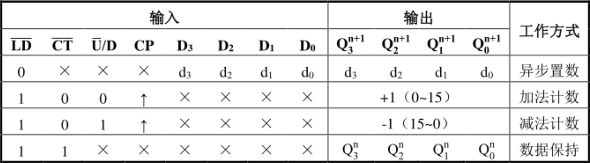
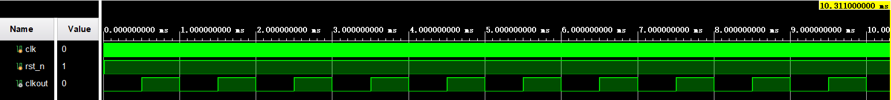
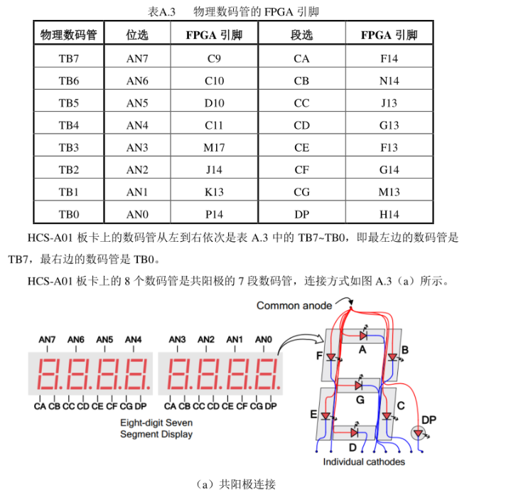

## 红绿灯系统

### 快速上手指南

只对源代码进行版本控制。每次拉取新的源码后可能需要手动将文件添加到工程中。

#### 第一次使用

在 vivado 中新建工程 RGB，完成基本配置。

使用 GitHub desktop 可以避免学习 git 操作的痛苦，[在此下载](https://desktop.github.com/)

打开 GitHub desktop 通过快捷键 `crtl + shift + o` clone 仓库 `RGB-digit`。clone 后手动将 src 文件夹中的源码添加到工程中

如果拿到的工程已经比较庞大，可以使用 RGB.tcl 文件重建工程。随便找了个[博客](https://bbs.huaweicloud.com/blogs/detail/178615)，跟着这个做应该就行了。

#### commit

文件命名规则：`{模块名}.v`

测试模块：`{模块名}Test.v`

完成修改后，在 GitHub desktop 中的左下角填写 commit 信息后点击 commit to master，然后 push 到远端仓库即可。

如果完成了新的模块，记得在模块 API 中修改对应的完成情况。比如，完成 m74LS191 后，修改标题为

#### module m74LS191 | DONE

或

#### module m74LS191 | DONE | to be test

并补充对应细节（如约束绑定）

### 模块 API

**时钟信号均为上跳沿触发**

#### module RGB

```
@input Duration[3:0] 每一种颜色的持续时间
@input Color[1:0]    当前设置的是哪种颜色 00: red; 01: green; 11: yellow; 10: unused;
@input SET           0->1: 进行设置
@input EN            整个系统的工作与否 1: 工作 0: 不工作
@input Clock
@output AN[7:0]		 数码管位选
@output DP[7:0]      数码管段选
@output Green
@output Red
@output Yellow
```

#### module m74LS191

```
@input LD_
@input CT_
@input UD
@input CP
@input D[3:0]
@output Q[3:0]
```

 

#### module divider | DONE

```
@input clk
@input EN
@output CP
```

100MHz -> 1KHz

使用参数调用来获得其他比例的分配器，如 divider  #(.WIDTH(4),.N(10))  u1, assert(N mod 2 == 0)



默认分频情况

#### module clock

```
@input EN	使能
@input clk
@output CP	一秒一次的脉冲
```

#### module inBottom

执行按键的消抖

```
@input IN
@output OUT
```

#### module lightCTL

```
@input RedDuration[3:0]
@input GreenDuration[3:0]
@input YellowDuration[3:0]
@input EN				使能
@input CP
@output Red
@output Green
@output Yellow
@output CountDown[3:0]
```

通过调用 `m74LS191` 来对灯进行控制

#### module numberDisplayOne | DONE

控制数码管

```
@input EN
@input Number[3:0]
@output DP[7:0]		段选
```

从左至右输出，即 TB1 为高位，TB0 为低位。



DP[7] => DP

DP[0] => CA

#### module freshClock | DONE

```
@input EN	使能
@input clk
@output CP	1KHz 脉冲
```

#### module numberDisplay | DONE

```
@input EN
@input Number[3:0]
@input clk
@output DP	段选
@output AN	位选
```

通过上面两个模块完成稳定的输出。

测试完成，输出十分稳定。

